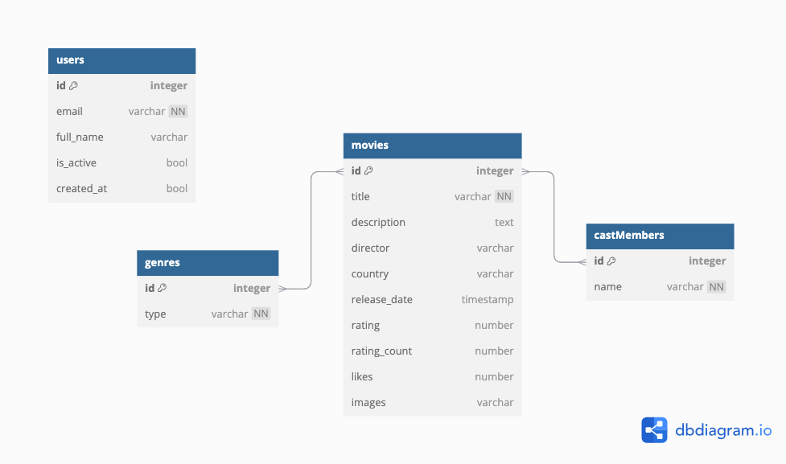

# **Backend Setup and Execution (FastAPI)**

1. **Clone the repository**:

   Clone this project to your local machine:

   ```bash
   git clone https://github.com/your-username/your-repository.git
   cd your-repository
   ```
2. **Navigate to the backend folder**:

   ```bash
   cd backend
   ````
3. **Create and activate a Python virtual environment**:

   For Windows:

   ```bash
   python -m venv venv
   venv\Scripts\activate 
   ```

   For Mac:

   ```bash
   python3 -m venv venv
   source venv/bin/activate 
   ```
4. **Install backend dependencies**:

   For Windows:

   ```bash
   pip install fastapi uvicorn
   pip install pytest httpx
   pip install sqlalchemy databases[sqlite]
   pip install fastapi[all]
   pip install sqlmodel
   pip install alembic
   pip install passlib
   pip install bcrypt
   pip install python-jose
   pip install requests
   pip install cloudinary
   pip install selenium
   pip install webdriver_manager
   ```

   For Mac:

   ```bash
   pip install fastapi uvicorn
   pip install pytest httpx
   pip install sqlalchemy databases\[sqlite\]
   pip install fastapi\[all\]
   pip install sqlmodel
   pip install alembic
   pip install passlib
   pip install bcrypt
   pip install python-jose
   pip install requests
   pip install cloudinary
   pip install selenium
   pip install webdriver_manager
   ```
5. **Sep up for Alembic (databases)**:

   - Once you've reviewed the migration script and are confident it's correct, you can apply it to the database with:

   ```bash
   alembic upgrade head
   ```

   Now, you should have a sqlite file called: src/filmhub_database.db

   - If something goes wrong, you can roll back to a previous migration using the downgrade command. For example, to revert to the migration just before the most recent one:

   ```bash
   alembic downgrade -1
   ```

   Now you need to eliminate the last alembic version file, and run again this command:

   ```bash
   alembic upgrade head
   ```
6. **Run backend tests (optional, but recommended to ensure everything is working correctly)**:

   ```bash
   python -m pytest
   ```
7. **Run the backend server**:

   Start the FastAPI server:

   ```bash
   uvicorn app.main:app --reload
   ```

   The backend will be available at http://localhost:8000.
8. **Deactivate the virtual environment when you're done working on the backend**:

   ```bash
   deactivate
   ```

### Backend quick start:

For Mac:

```bash
 cd src/backend
 source venv/bin/activate
 alembic upgrade head
 uvicorn app.main:app --reload
```

For Windows:

```bash
 cd src/backend
 venv\Scripts\activate
 alembic upgrade head
 uvicorn app.main:app --reload
```

# **Backend Documentation**

## Project Overview

**FilmHub** is a web application that allows users to search for, review, and rate movies. Built using python (with FastAPI) and Vue.js, it offers a seamless experience for movie enthusiasts to explore and manage movie-related data. In this section we will explain the logic and decisions done for the backend.

## Database Design

We have the following schema for our database model:



Those classes are created in the folder src/backend/app/models.

## API Documentation

We could see the details of the endpoints created when you launch APIFast on localhost.

The related files are found in src/backend/app/crud and src/backend/app/api/routes.

## Authentication and Authorization

* **Authentication Methods**: JWT (JSON Web Tokens)
* **User Roles**: Users can have different roles (admin, user) with varying permissions.

## Testing

We use some unit implemented with pytest in the folder src/backend/app/tests.

## Data inicialization

For deploy and test the website, we inicializated a list of admin users and a list of movies.
You could find them at:

- users inicialization: src/backend/app/api/routes/user_routes.py
- movies inicialization: src/backend/app/db/init_movie_db.py

We finally iniciate these datas from main.py.
