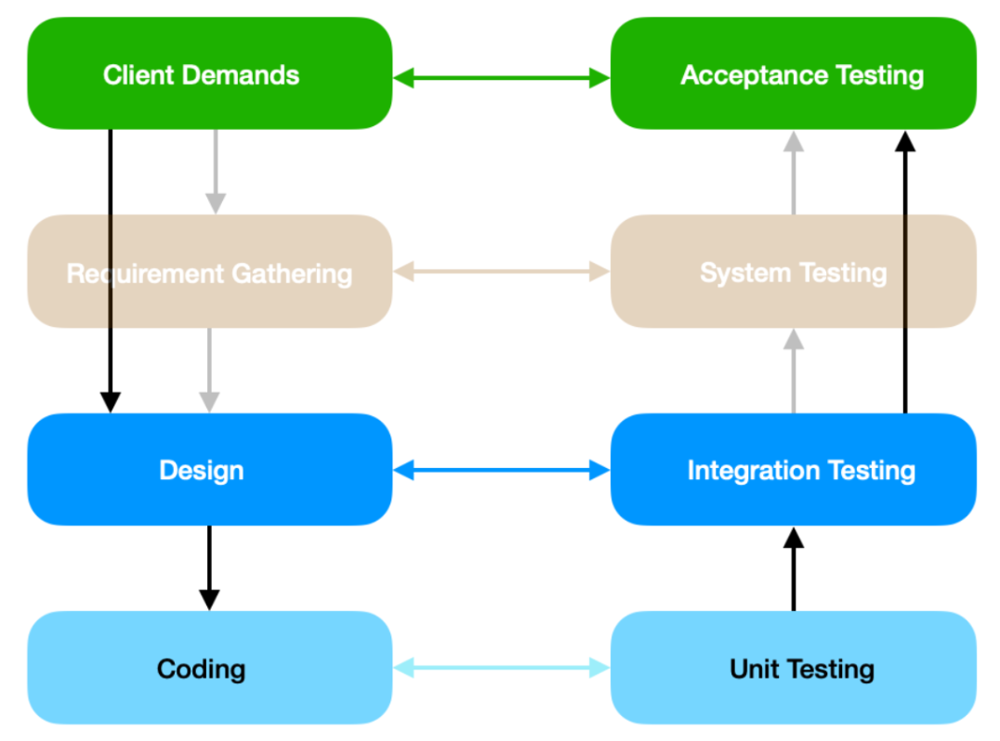

# /tests

# FilmHub Testing Plan

## Testing Overview

This document outlines the testing strategy for FilmHub, covering different testing levels to ensure the functionality, integration, and user acceptance of the platform. Below is the testing flow overview:



---

### 1. **Coding - Unit Testing**

- **Objective**: Verify the correctness of individual methods, particularly CRUD operations in the backend.
- **Tools Used**:
  - `pytest-mock` for mocking and testing.
  - `PyLint` to ensure proper code semantics for Python.
  - `ESLint` for maintaining quality in the Vue.js frontend.
- **Execution**:
  - Unit tests were created for backend methods to validate basic functionalities.
  - To run the unit tests:
    ```bash
    cd src/backend
    python -m unittest discover app/crud/tests
    ```

---

### 2. **Design - Integration Testing**

- **Objective**: Test API routes and their functionalities by simulating real interactions between components.
- **Approach**:
  - Implemented a Test-Driven Development (TDD) approach:
    1. Write a test.
    2. Run the test to ensure it fails (route not yet implemented).
    3. Write code to pass the test and ensure it still passes after refactoring.
  - Used `pytest` with assertions for expected outcomes.
- **Tools**:
  - **Selenium**: Automated end-to-end testing of the frontend, ensuring proper data interactions and modifications across Frontend, Backend, and Database.
  - **Coverage**: Monitored test coverage and aimed for 100%.

---

### 3. **Requirement Gathering - System Testing**

- **Note**: As the system components are not significantly complex, system-level testing was not implemented. The focus remains on backend, frontend, and database integration.

---

### 4. **Client Demands - Acceptance Testing**

- **Objective**: Validate acceptance criteria and website functionality.
- **Testing Types Implemented**:
  - **Usability Testing**: User tests to assess intuitiveness and coherence.
  - **Compatibility Testing**: Verified functionality on Mac and Windows. Mobile responsiveness is still pending.
- **Testing Types Pending**:
  - **Performance Testing**: Not prioritized as the current system does not expect heavy traffic. Future improvements will consider Azure’s capabilities.
  - **Security Testing**: Not required due to the absence of sensitive data (e.g., banking or personal addresses).

#### 4.1. **Interface Testing**

- Ensured that links and forms are functional and in a proper state.

#### 4.2. **Usability Testing**

- Cross-referenced Trello User Stories to verify successful implementation of acceptance criteria.

---

## Common Issues and Resolutions

### Unittest Errors

- **Issue**: Functions like `create_movie` did not validate if movies or users existed, leading to potential runtime errors.
- **Resolution**: Added checks to ensure the existence of required entities.

### Consistency Errors

- **Issue**: Circular imports between classes.
- **Resolution**: Extracted shared functionality into a new file (`db_utils.py`).

### Linter Warnings

- **PyLint**:
  - Duplicate endpoint names in `movies_routes.py`.
  - Variables potentially used before assignment in `scrape_movies.py`.
- **ESLint**:
  - Missing Babel configuration file for Vue components.

---

## Annex: User Testing

- **Focus**: Assessed intuitiveness and coherence of the platform.
- **Document**: see in the same folder UserTests.pdf.
